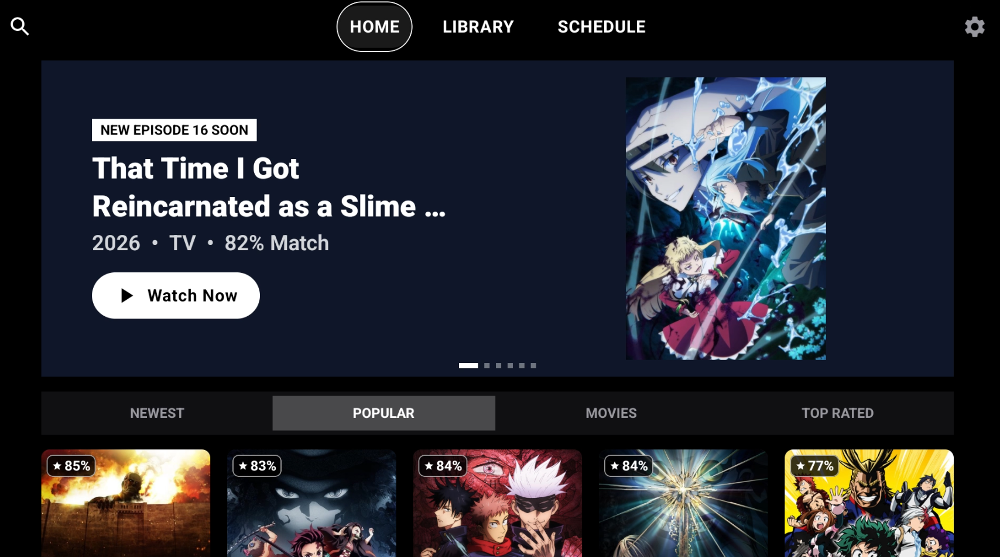
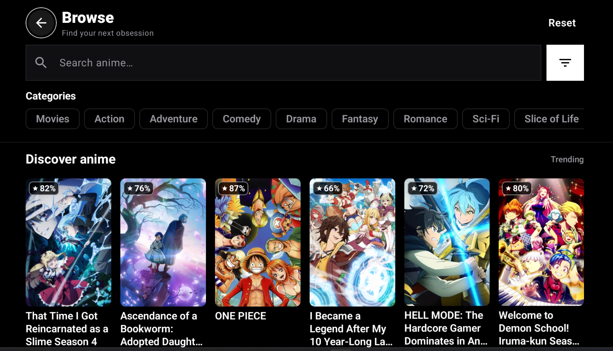
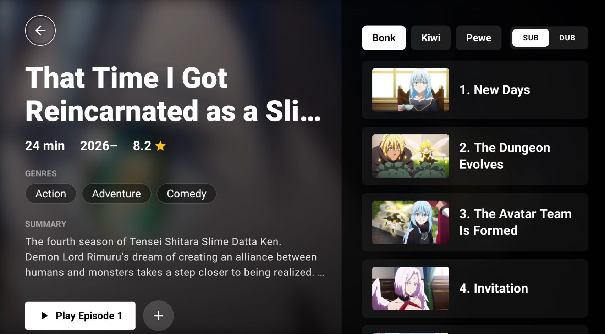
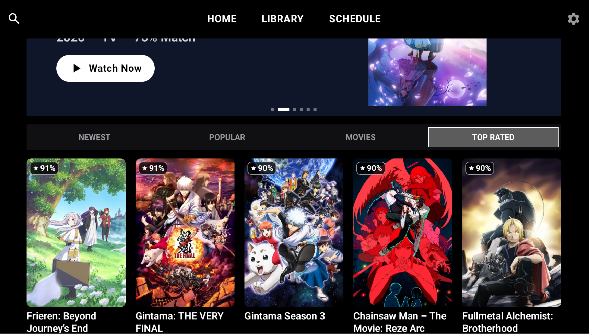
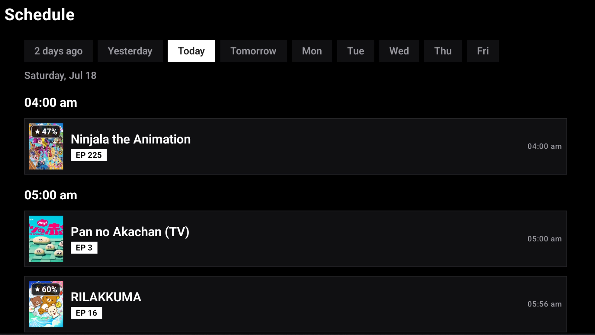

# Anilili-TV

Anilili is a native Android anime streaming client built with Kotlin, Jetpack Compose, and Media3. **This specific fork has been optimized for Android TV devices**, with modern Material 3 interface and full D-pad remote support. 

Metadata, login, library lists, and progress sync are powered by AniList, while episodes and stream sources are resolved from multiple providers: Miruro, AniKoto, ReAnime, AniZone, AnimeGG, AniNeko, and 2DHive.

Miruro streams are requested through the Miruro pipe endpoint and decoded on device. Additional provider sources are resolved through the Anivexa-backed provider client. HLS streams play with ExoPlayer; embed providers and fallback playback use WebView.

> Personal and educational project. This app is not affiliated with AniList, Miruro, AniKoto, ReAnime, AniZone, AnimeGG, AniNeko, or 2DHive. Distribute as a sideloaded APK.

## Screenshots

  
  
  

  
  
 </a>

